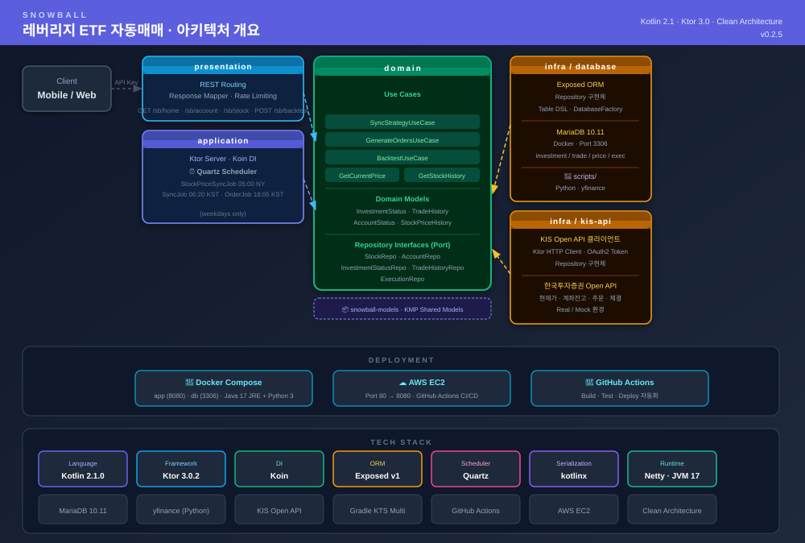

# Snowball

**레버리지 ETF 자동매매 시스템** — Kotlin 기반 백엔드



---

## 아키텍처

```
snowball/
├── presentation/          # REST 라우팅, Response Mapper, Rate Limiting
├── application/           # Ktor 서버 진입점, Koin DI, Quartz 스케줄러
├── domain/                # Use Cases, Domain Models, Repository 인터페이스
├── infrastructure/
│   ├── database/          # Exposed ORM, MariaDB Repository 구현체
│   └── kis-api/           # KIS Open API HTTP 클라이언트, Repository 구현체
├── snowball-models/       # KMP 공유 모델
└── scripts/               # Python yfinance 주가 데이터 수집 스크립트
```

---

## 기술 스택

| 구분 | 기술 |
|------|------|
| Language | Kotlin 2.1.0 (KMP) |
| Framework | Ktor 3.0.2 (Server + HTTP Client) |
| DI | Koin |
| ORM | Exposed v1 (Kotlin SQL DSL) |
| Database | MariaDB 10.11 |
| Scheduler | Quartz (Cron 기반) |
| Serialization | kotlinx.serialization |
| Runtime | Netty · JVM 17 |
| Data Source | Yahoo Finance (Python yfinance) |
| Broker API | 한국투자증권 KIS Open API (Real / Mock) |
| Container | Docker Compose |
| CI/CD | GitHub Actions → AWS EC2 |

---

## 배포

```
GitHub Actions
    └─▶ Docker build
            └─▶ AWS EC2
                    ├─ app  (Port 80 → 8080, Java 17 JRE + Python 3, -Xmx384m)
                    └─ db   (MariaDB 10.11, Port 3306)
```
